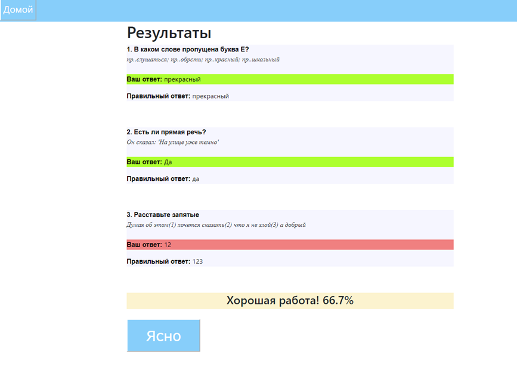
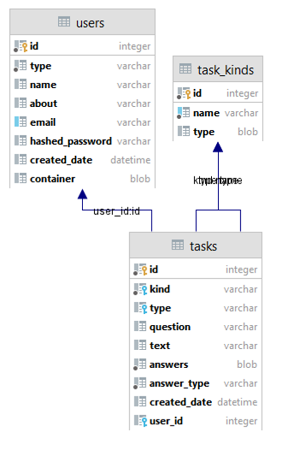
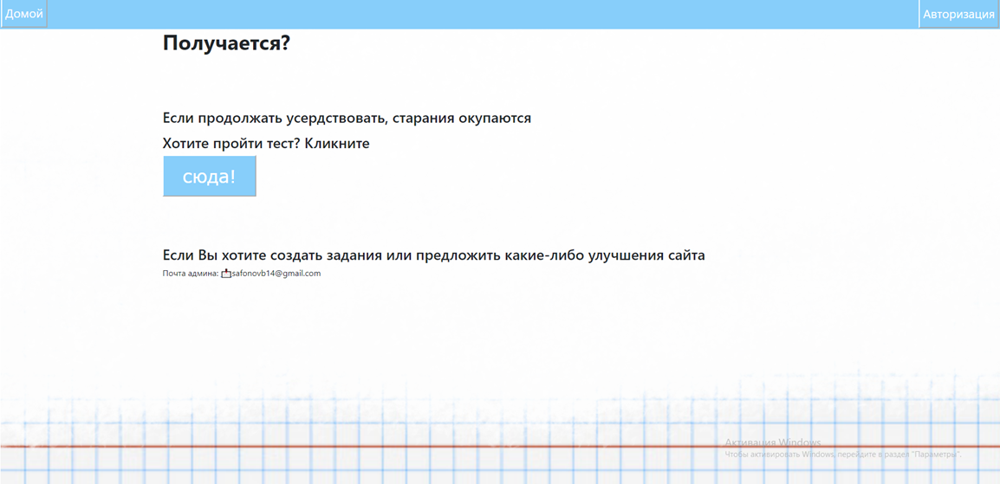

# Web Tester

Платформа для создания и прохождения образовательных тестов с системой ролевого доступа.

## Возможности

### Для всех пользователей:
- **Регистрация** с указанием имени, email, описания и статуса
- **Авторизация** с сохранением сессии
- **Прохождение тестов** с выбором количества вопросов по темам
- **Просмотр результатов** в процентах после завершения теста
- **История прогресса** для студентов

### Для учителей:
- **Создание заданий** с разбивкой по темам и подтемам
- **Управление темами** - добавление новых категорий заданий
- **Генерация ключей** для регистрации новых преподавателей

### Для администраторов:
- **Управление пользователями** - добавление и удаление
- **Контроль доступа** - назначение ролей учителей
- **Администрирование системы**

## 🏗 Технологический стек

### Backend:
- **Python 3.x** - основной язык программирования
- **Flask** - веб-фреймворк
- **Flask-Login** - аутентификация пользователей
- **Flask-WTF** - работа с формами
- **SQLAlchemy** - ORM для работы с базой данных
- **Werkzeug** - безопасность и хеширование паролей

### Frontend:
- **HTML** - разметка страниц
- **CSS** - стилизация
- **Jinja2** - шаблонизация

### Дополнительные библиотеки:
- **Pickle** - сериализация данных
- **Datetime** - работа с датами и временем
- **Random** - генерация случайных данных

## База данных
### Модели данных включают:

- User - пользователи системы
- Task - задания тестов
- Task_Kinds - категории и подкатегории заданий

Инициализация БД происходит автоматически при первом запуске.

### Безопасность
- Пароли хранятся в хешированном виде
- Сессии защищены секретным ключом
- Валидация всех входящих данных
- Защита от CSRF атак через Flask-WTF

## Интерфейс
**Приложение использует чистый HTML/CSS с адаптивными шаблонами:**
- Главная страница с приветствием
- Формы авторизации и регистрации
- Личный кабинет с ролевым функционалом
- Страница создания и прохождения тестов
- Для студентов ведется история результатов тестирования с возможностью отслеживания прогресса.

Платформа предназначена для образовательных учреждений, репетиторов и корпоративного обучения.